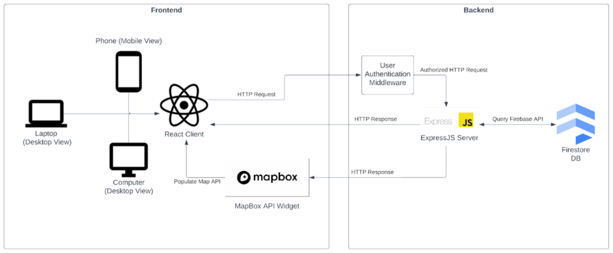
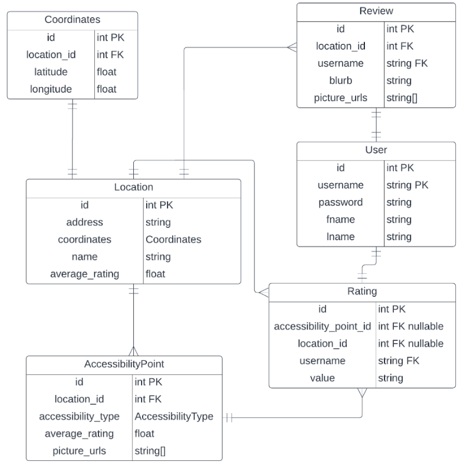
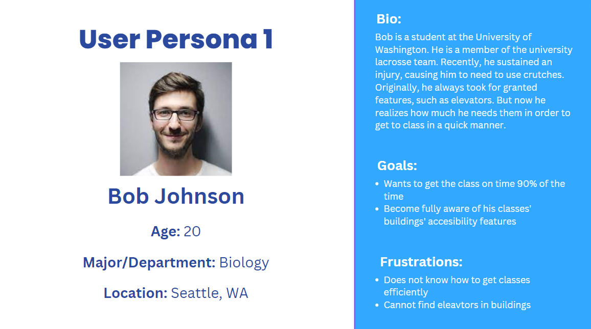
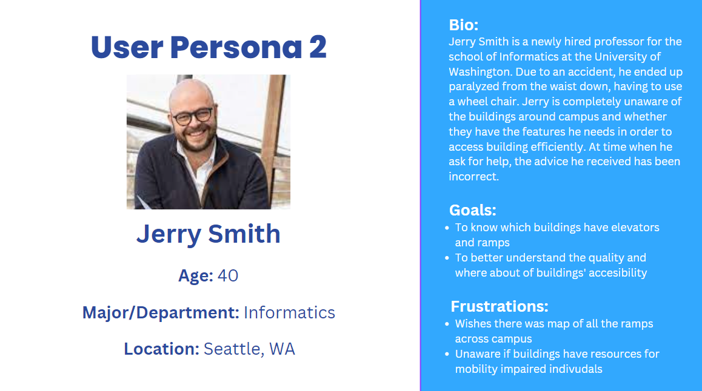

# Mapable
### An application to increase visibility of accessibility information
Created by Keith Ellingwood, Elbert Cheng, Brian Park, Jonathan Trinh, Christopher Kim

### Link to deployed website
https://mapable-info442.herokuapp.com/
___

## Introduction

This project was created for INFO 442 Au 2022, Cooperative Software Development, at the University of Washington. For this project, we had to create an application to address one of the UN's Sustainable Development Goals (SDGs), and for the SDG we chose to focus on, we had a few in mind, but ultimately settled on Goal 10, Reduced Inequalities. Specifically, we want to focus on improving the lives of those with mobility impairments. In an ever developing modern world, the consideration of those with mobile disabilities and incorporating inclusive design in urban infrastructure is becoming more and more important. Thus, we aim to tackle a common problem of noninclusive design by making information about accessible areas easier to access and use.

For our problem statement, we want to know: **How might we improve the commute experience of mobility-impaired individuals by cultivating the accessibility information regarding urban areas?**

To address this problem, we want to create an interactive application that allows users to find, view and rate accessibility data of public locations much easier and more efficiently. In this application, we will have a map that allows users to view locations, as well as certain accessibility landmarks within these locations (ramps, elevators, ect). When the user clicks on these landmarks/locations, they have the ability to rate locations based on accessibility features and uploade written reviews of points of interest with accessible features at said location. This will empower our users to crowdsource accessibility data and lead to a more reliable source of accessibility data.

___

## Requirements and Architecture

To provide a thorough Minimal Viable Product to start addressing our problem space, we have implemented these P0 (highest priority) requirements:
- Interactive, geographic map
- Interactive pins
- User login/signup
- Ability to create text reviews for buildings
- Ability to see and give rating feedback
- Building information (details) page
- Ability to upload, store, and show photos

### Technical Dependencies

**Frontend:**
- React.JS
- Mapbox GL JS
- React-Bootstrap

**Backend:**
- Express JS
- Google Firebase Firestore (Database Hosting)
- Heroku Hosting (Backend API Hosting & web domain hosting all in one)

**Other:**
- Node.JS (Package Modules)
- Github (Version Control)
- Nodemon (Development Tool)
- VSCode Debugger (Development Tool)

### Architecture Diagram

### Data Model

___

## User Profiling and Testing

### User Personas

### Testing Protocol

**Login verification**
- Type in the username and password
- If the username and password do not match, show error message
- If the username and password do match, continue to main home page

**Buttons displaying the correct overlay**
- Have correct information and layout pop up for the corresponding button that has been clicked
- Make sure the button does what it says its going to do

**Rating system from the accessibility points correctly calculating the average rating for the building.**
- Click on the building
- Scroll to ratings section
- Check math to take the average rating and correlating that to the correct type of smiley face

**The building information displaying the correct information from the database**
- Click on the building icon
- Check if the name, information, address, etc, for the building is correct
- Make sure the rating is correct as well

**Ratings and Reviews are saved for the building review for other users to see**
- Click the building icon
- Scroll to the ratings section
- See if you can see all of the reviews made for the building

**Zoom in feature for accessibility locations and features**
- Zoom in on the building and see if the correct accessibility feature icons show up in the correct locations

**Reactive Design**
- Use Google Chrome's window resize tool in inspect element to simulate mobile screen sizes
- Confirm that functionality and design are perserved when changing screen size
- Test application on both iPhone and Android

**General Accessibility**
- Use Google Chrome's colorblindness emulator to ensure accessible visual design
- Use screenreader to test ARIA labels on web elements

___

## Deployment

**Backend server:**

In /server folder, run `npm install` to install dependencies, then run `npm debug start`

**Frontend client:**

In /client folder, run `npm install` to install dependencies, then run `npm run start`

___

## Attributions

- John3 on TopPNG for our automatic door icon base https://toppng.com/door-sensor-alarmed-ico-PNG-free-PNG-Images_240184
- The Accessible Icon Project for our ramp icon base https://accessibleicon.org/